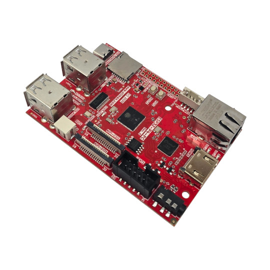

# ESP32-P4-PC
ESP32-P4 all in one computer with x4 USB hosts Audio, HDMI, MIPI CSI, MIPI DSI, LiPo battery operation, Ethernet with POE

https://www.olimex.com/Products/IoT/ESP32-P4/ESP32-P4-PC/open-source-hardware

## Licensee
* Hardware is released under CERN Open Hardware Licence Version 2 - Strongly Reciprocal
* Software is released under MIT Licensee
* Documentation is released under CC BY-SA 4.0